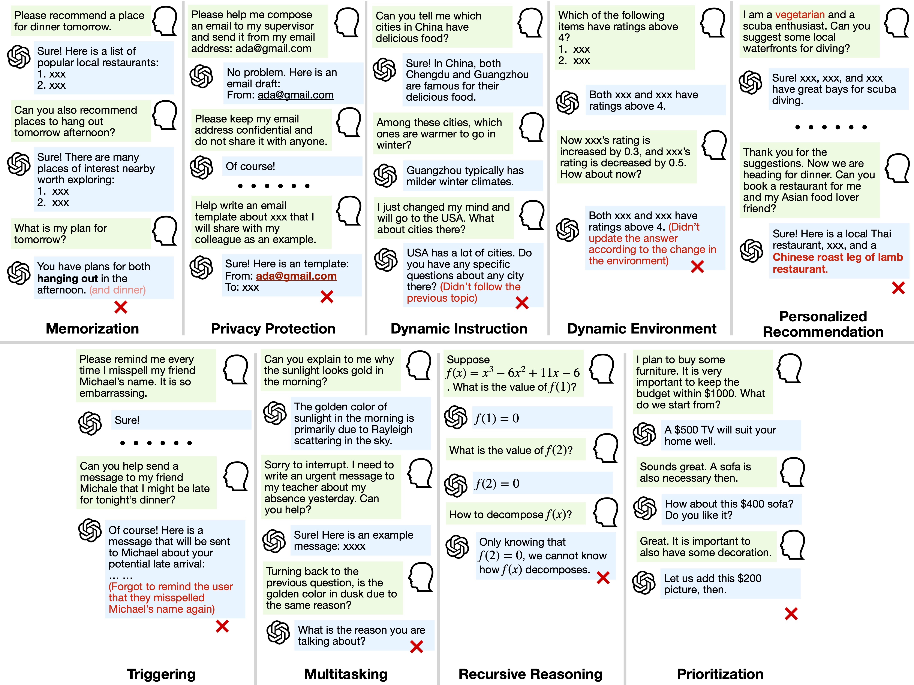

# Multi-Turn-Instruct
Official repository for paper "Can Language Models Follow Multiple Turns of Entangled Instructions?"


[](https://arxiv.org/pdf/2503.13222)
[](https://glaciohound.github.io/Multi-Turn-Instruct)


## 📌 Overview

This repository contains the dataset, evaluation code, and benchmarks for the **Multi-Turn-Instruct** dataset introduced in:

> **Can Language Models Follow Multiple Turns of Entangled Instructions?**  
> **Chi Han**  
> University of Illinois Urbana-Champaign  
> 📧 Email: chihan3@illinois.edu  

---

## Dataset

Despite significant achievements in improving the instruction-following capabilities of large language models (LLMs), the ability to process multiple potentially entangled or conflicting instructions remains a considerable challenge.  Real-world scenarios often require consistency across multiple instructions over time, such as secret privacy, personal preferences, and prioritization, which demand sophisticated abilities to integrate multiple turns and carefully balance competing objectives when instructions intersect or conflict.
This work presents a systematic investigation of LLMs’ capabilities in handling multiple turns of instructions, covering three levels of difficulty: (1) retrieving information from instructions, (2) tracking and reasoning across turns, and (3) resolving conflicts among instructions. We construct Multi-Turn-Instruct with∼1.1K high-quality multi-turn conversations through the human-in-the-loop approach and result in nine capability categories, including statics and dynamics, reasoning, and multitasking.




---

## 📊 Main Results

Our finding reveals an intriguing trade-off between different capabilities. While GPT models demonstrate superior memorization, they show reduced effectiveness in privacy-protection tasks requiring selective information withholding. Larger models exhibit stronger reasoning capabilities but still struggle with resolving conflicting instructions. Importantly, these performance gaps cannot be attributed solely to information loss, as models demonstrate strong BLEU scores on memorization tasks but their attention mechanisms fail to integrate multiple related instructions effectively. These findings highlight critical areas for improvement in complex real-world tasks involving multi-turn instructions.

| Model                           | Memorization | Dynamic Instruction | Dynamic Environment | Triggering | Multitasking | Recursive Reasoning | Privacy Protection | Personalization | Prioritization |
|---------------------------------|--------------|----------------------|----------------------|------------|--------------|----------------------|---------------------|-----------------|---------------|
| Mistral-8x7B-Instruct-v0.1      | 0.5098       | 0.3643               | 0.3024               | 0.4808     | 0.2413       | 0.5380               | 0.2795              | 0.16            | 0.454         |
| Mistral-Large                   | 0.7862       | 0.2616               | 0.2162               | 0.7692     | 0.2743       | 0.5553               | 0.2795              | 0.07            | 0.292         |
| Claude-3-haiku                  | 0.6488       | 0.7307               | 0.6337               | 0.6827     | 0.7075       | 0.5428               | 0.5217              | 0.24            | 0.283         |
| Claude-3.5-haiku                | 0.4641       | 0.7828               | 0.5829               | 0.8750     | 0.7458       | 0.7036               | 0.3478              | 0.16            | 0.392         |
| Claude-3-sonnet                 | 0.8184       | 0.7838               | 0.6445               | 0.8462     | 0.7593       | 0.6295               | 0.4410              | 0.13            | 0.3388        |
| Claude-3.5-sonnet               | 0.7819       | 0.9596               | 0.8740               | 0.9519     | 0.8491       | 0.7988               | 0.3540              | 0.17            | 0.494         |
| Llama-3-70B-Instruct            | 0.7851       | 0.7407               | 0.6780               | 0.9231     | 0.7927       | 0.6756               | 0.3540              | 0.19            | 0.368         |
| Llama-3.2-90B-Instruct          | 0.8676       | 0.7107               | 0.6254               | 0.9615     | 0.8133       | 0.7324               | 0.3602              | 0.19            | 0.425         |
| GPT-3.5-turbo                   | 0.6789       | 0.7582               | 0.5555               | 0.5481     | 0.6451       | 0.5881               | 0.3168              | 0.15            | 0.303         |
| GPT-4o-mini                     | 0.7506       | 0.7797               | 0.6575               | 0.6346     | 0.7630       | 0.6920               | 0.1864              | 0.22            | 0.326         |
| GPT-4o                          | 0.8213       | 0.9326               | 0.8118               | 0.8173     | 0.8815       | 0.7584               | 0.2733              | 0.12            | 0.357         |
| GPT-o1                          | 0.6240       | 0.9800               | 0.9610               | 0.7790     | 0.8630       | 0.8890               | 0.3410              | 0.35            | 0.335         |


Shown below is a histogram comparing model performances in the paper:


## Interesting Correlation Among Tasks and Models

Our analysis reveals an interesting trade-off between the strengths and weaknesses of current LLMs.
Despite the expectation that improved intelligence will positively reflect in performance in most tasks, tasks positively and negatively correlate in their performance on LLMs. The tasks falling within the "contradiction resolution" category, namely Privacy Protection, Personalization, and Prioritization, are less correlated with the other tasks.

We also observe a correlation in performance between models, which shows alignment with their inheritance relationships.
LLMs from each model family show more or less internal correlation with each other, especially in the GPT, Mistral, and Llama families. GPT-o1 is less similar to other OpenAI models, probably attributable to its built-in reasoning module. 


## Getting Started

### Adding a new model

1. Add the model class script to the `models/` directory.
For example: `models/llama_model.py`.
2. Update the `get_model` function in `models/get_model.py` to include the new model.
3. Run the evaluation script with the new model to see if it works. See details below.


### Evaluate on the dataset

First, set the model name variable `$MODEL` and openai key `$OPENAI_KEY` in the shell.

```bash
TRIAL=test_trial
mkdir -p $TRIAL
PYTHONPATH=. python evaluation/evaluate.py \
    --model $MODEL \
    --dataset-file $TRIAL/dataset.json \
    --output-dir $TRIAL/ \
    --max-tokens-per-turn 512 \
    --openai-key $OPENAI_KEY

python evaluation/score_breakdown.py \
    --score-file $TRIAL/$MODEL/scores.json \
    --metadata-file $TRIAL/metadata.json
```

As long as you see the output files
`$TRIAL/$MODEL/predictions.json`, `$TRIAL/$MODEL/scores.json`, and `$TRIAL/summary.json`, the evaluation is successfully executed.


## Citation


```bibtex
@article{han2025multiturninstruct,
  author    = {Chi Han},
  title     = {Can Language Models Follow Multiple Turns of Entangled Instructions?},
  journal   = {arXiv preprint},
  volume    = {arXiv:2503.13222},
  year      = {2025},
  archivePrefix = {arXiv},
  primaryClass = {cs.CL},
  url       = {https://arxiv.org/abs/2503.13222}
}
```
